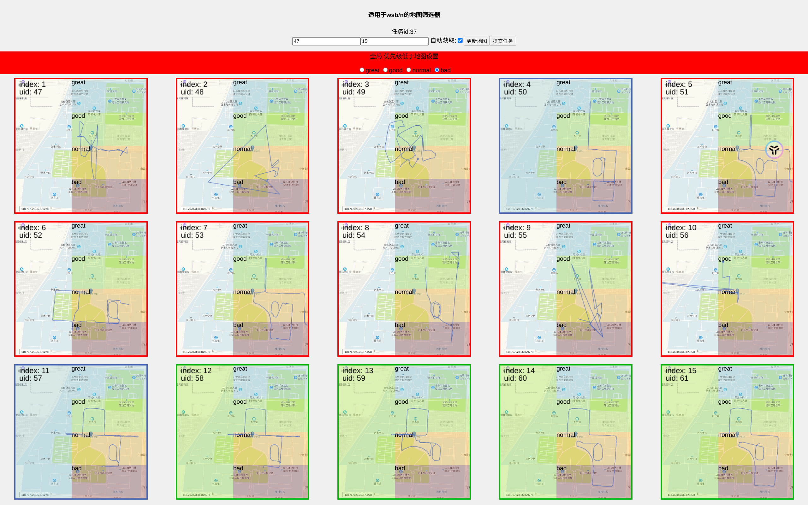

# wkyd_dbshow
地图筛选器  
配合[wkyd Debugger nodejs](https://github.com/xmexg/wdn)使用

- 潍坊科技学院
  

- 山东理工大学
  

## Project Setup

```sh
npm install
```

### Compile and Hot-Reload for Development

```sh
npm run dev
```

### Compile and Minify for Production

```sh
npm run build
```